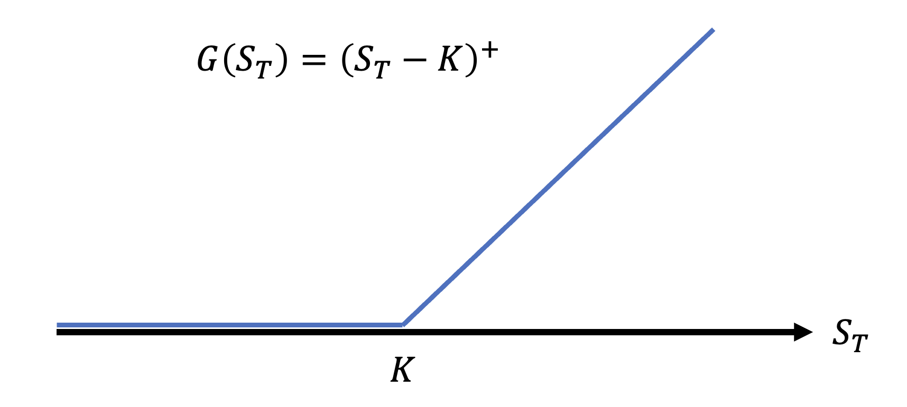
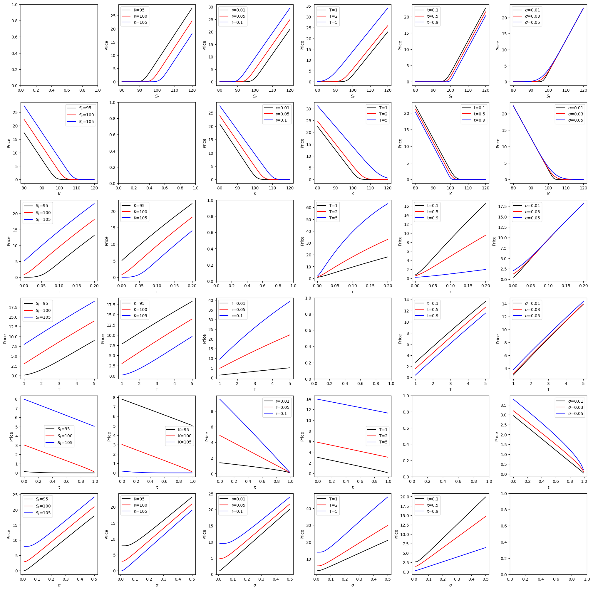
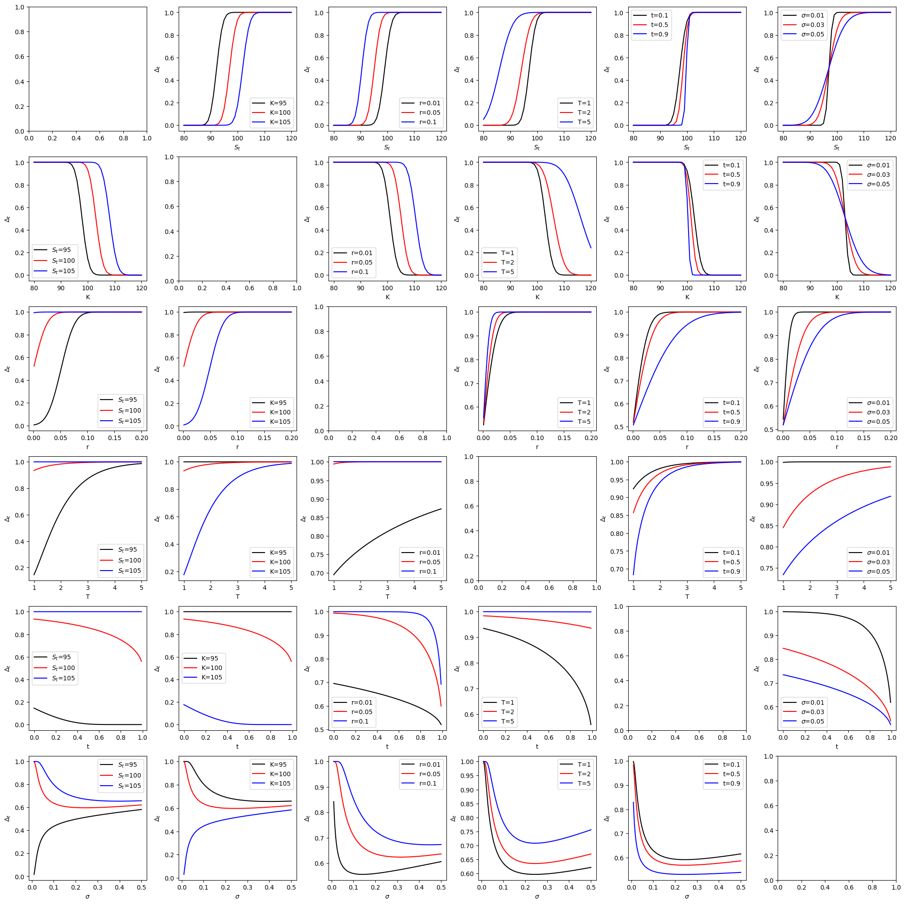
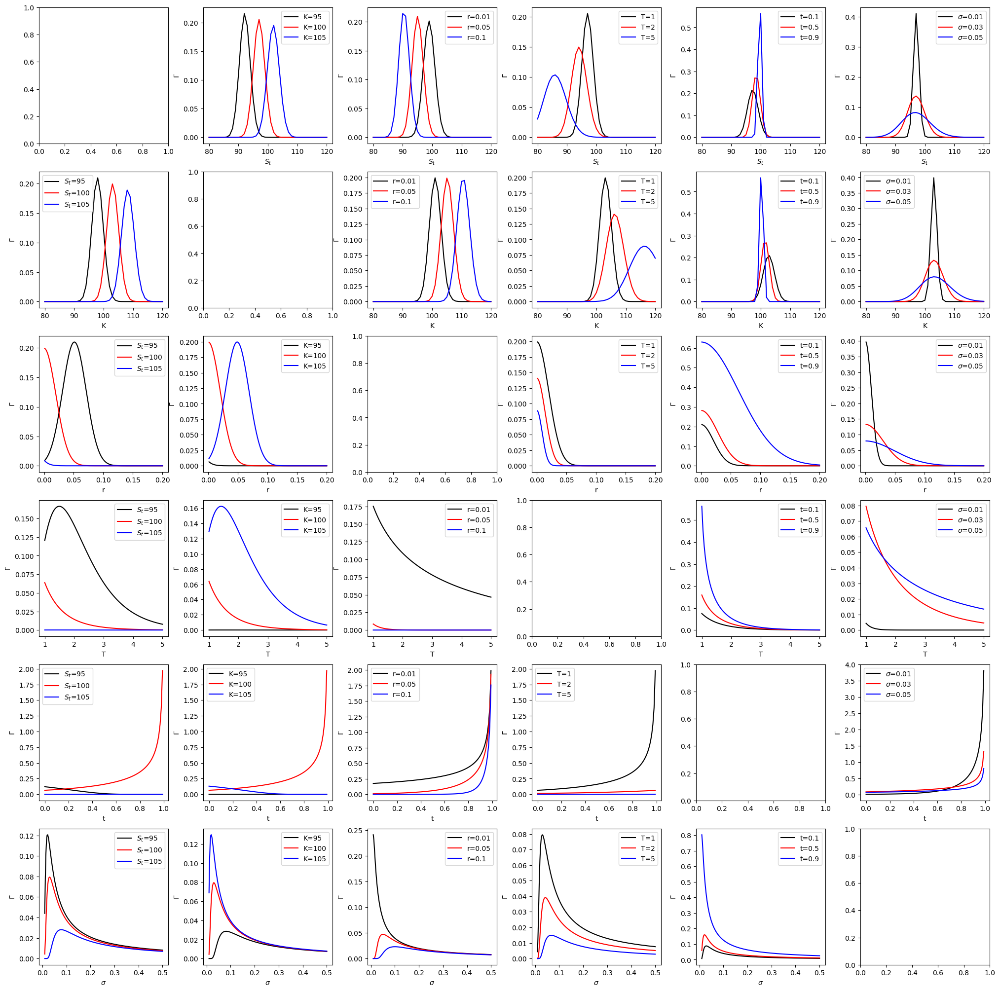
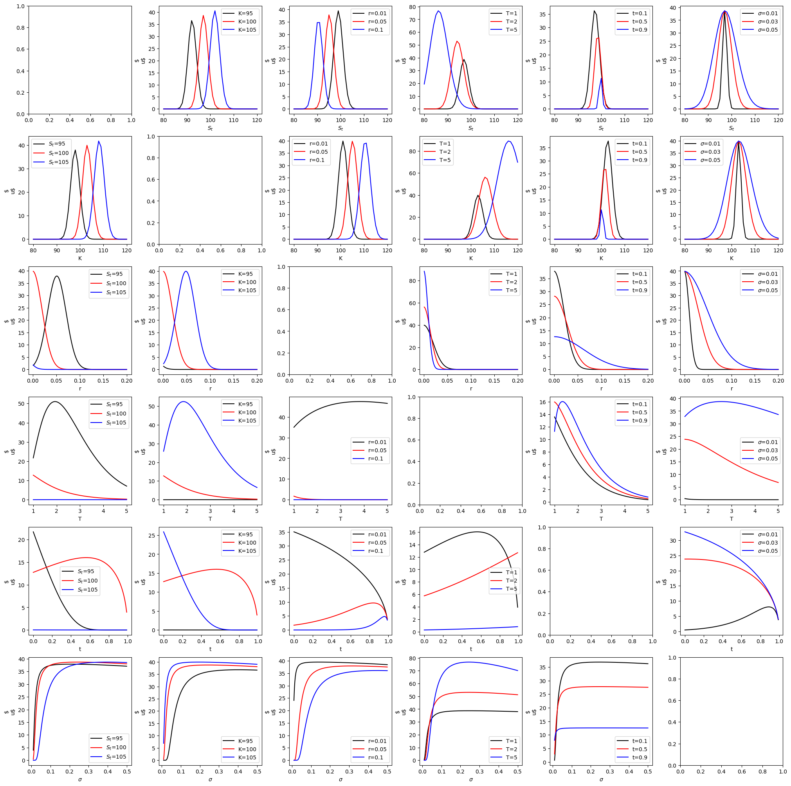
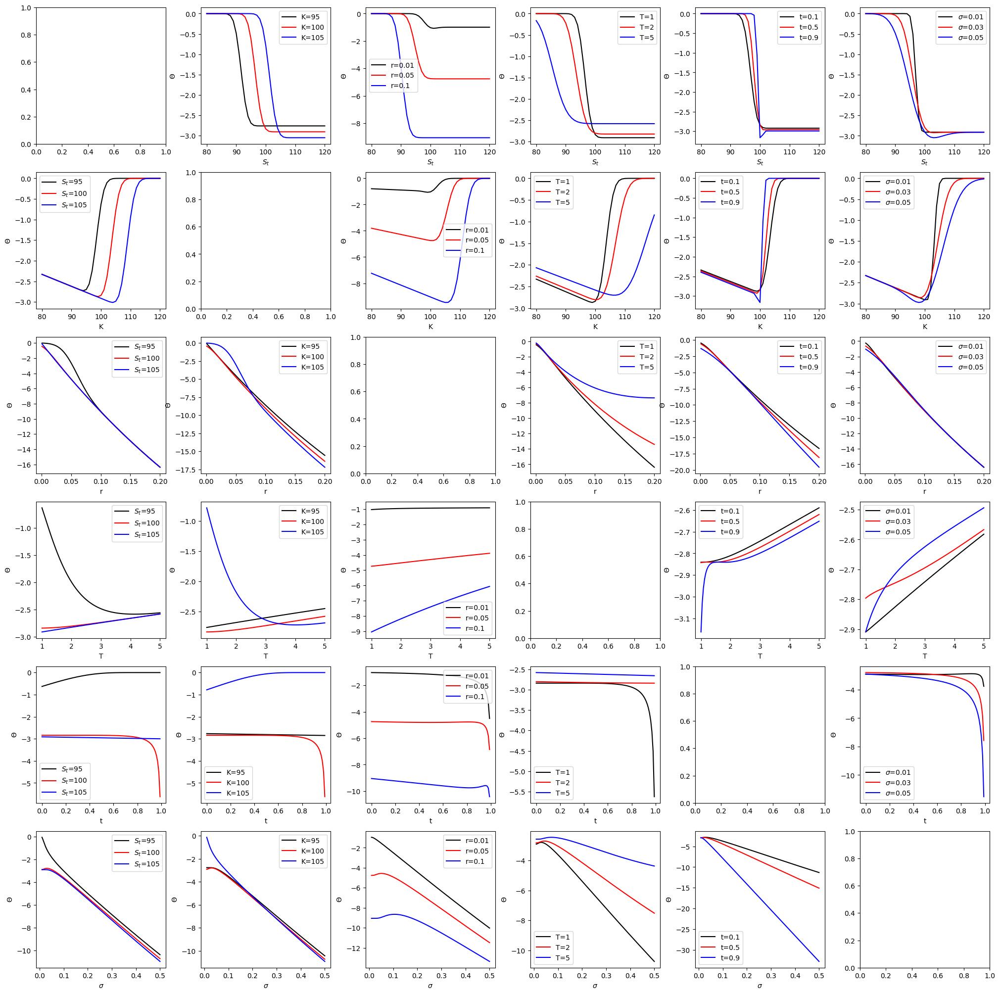
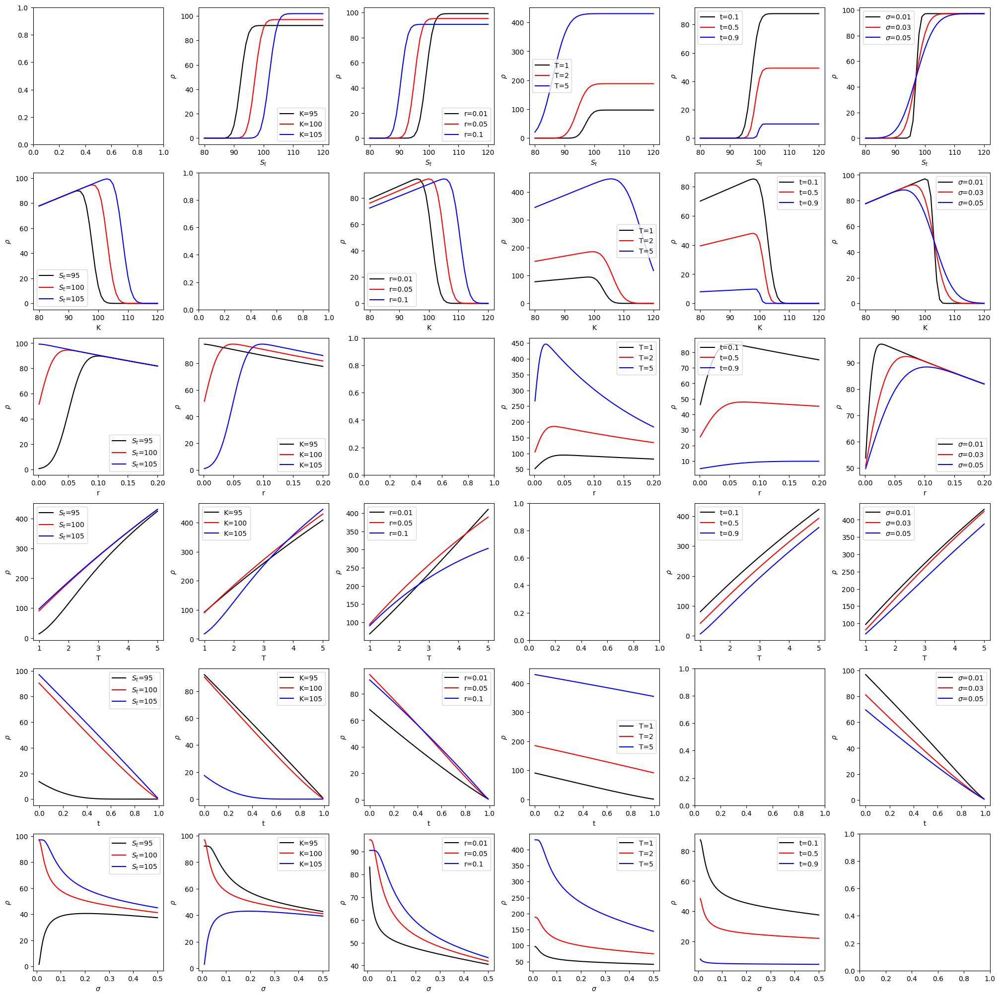

# European Call

## 1. 收益结构图像



## 2. 模型假设

### 2.1. 标的资产动态

假设标的资产满足几何布朗运动
$$
dS_t=S_t(rdt+\sigma dW_t^\Q)
$$
则有
$$
S_t=S_0\exp[\sigma W_t^\Q+(r-\frac{1}{2}\sigma^2)t]\\
S_T=S_t\exp[\sigma (W_T^\Q-W_t^\Q)+(r-\frac{1}{2}\sigma^2) (T-t)]\\
$$

### 2.2. 收益结构

$$
\hat{G}(S_T)=(\hat{S}_t-K)^+
$$

### 2.3. 欧式期权t时刻价格

我们要计算
$$
\hat{\Pi}_t=\mathbb{E}^\Q[\hat{G}(S_T)|\mathscr{F}_t]
$$
则有算式
$$
\begin{aligned}
\hat{\Pi}_t&=\mathbb{E}^\Q[\hat{G}(S_T)|\mathscr{F}_t]\\
&=\mathbb{E}^\Q[\frac{(S_T-K)}{e^{rT}}\mathbb{1}_{S_T>K}|\mathscr{F}_t]\\
&=\mathbb{E}^\Q[\frac{(S_t\exp[\sigma (W_T^\Q-W_t^\Q)+(r-\frac{1}{2}\sigma^2) (T-t)]-K)}{e^{rT}}\mathbb{1}_{S_t\exp[\sigma (W_T^\Q-W_t^\Q)+(r-\frac{1}{2}\sigma^2) (T-t)]>K}]\\
\hat{\Pi}_t&=\frac{\Pi_t}{e^{rt}},W_T^\Q-W_t^\Q=X\sim N(0,T-t)\\
\Pi_t&=\int_{x>\frac{\log\frac{K}{S_t}-(r-\frac{1}{2}\sigma^2)(T-t))}{\sigma}}[S_te^{\sigma x-\frac{1}{2}\sigma^2(T-t)}-Ke^{-r(T-t)}]\frac{1}{\sqrt{2\pi(T-t)}}e^{-\frac{x^2}{2(T-t)}}dx\\
&=S_t\int_{x>\frac{\log\frac{K}{S_t}-(r-\frac{1}{2}\sigma^2)(T-t))}{\sigma}}\frac{1}{\sqrt{2\pi(T-t)}}e^{-\frac{x^2-2\sigma(T-t)x+\sigma^2(T-t)^2}{2(T-t)}}dx\\
&\ -Ke^{-r(T-t)}\int_{x>\frac{\log\frac{K}{S_t}-(r-\frac{1}{2}\sigma^2)(T-t))}{\sigma}}\frac{1}{\sqrt{2\pi(T-t)}}e^{-\frac{x^2}{2(T-t)}}dx
\end{aligned}
$$
对于前一项，有
$$
\begin{aligned}
&S_t\int_{x>\frac{\log\frac{K}{S_t}-(r-\frac{1}{2}\sigma^2)(T-t))}{\sigma}}\frac{1}{\sqrt{2\pi(T-t)}}e^{-\frac{x^2-2\sigma(T-t)x+\sigma^2(T-t)^2}{2(T-t)}}dx\\
&=S_t\int_{x>\frac{\log\frac{K}{S_t}-(r-\frac{1}{2}\sigma^2)(T-t))}{\sigma}}\frac{1}{\sqrt{2\pi(T-t)}}e^{-\frac{(x-\sigma(T-t))^2}{2(T-t)}}dx,y=\frac{x-\sigma(T-t)}{\sqrt{T-t}}\\
&=S_t\int_{y>\frac{\log\frac{K}{S_t}-(r+\frac{1}{2}\sigma^2)(T-t)}{\sigma\sqrt{T-t}}}\frac{1}{\sqrt{2\pi}}e^{-\frac{y^2}{2}}dy\\
&=S_t\int_{y<-\frac{\log\frac{K}{S_t}-(r+\frac{1}{2}\sigma^2)(T-t)}{\sigma\sqrt{T-t}}}e^{-\frac{y^2}{2}}dy\\
&=S_t\Phi(\frac{\log\frac{S_t}{K}+(r+\frac{1}{2}\sigma^2)(T-t)}{\sigma\sqrt{T-t}})
\end{aligned}
$$
对于后一项，有，
$$
\begin{aligned}
&Ke^{-r(T-t)}\int_{x>\frac{\log\frac{K}{S_t}-(r-\frac{1}{2}\sigma^2)(T-t)}{\sigma}}\frac{1}{\sqrt{2\pi(T-t)}}e^{-\frac{x^2}{2(T-t)}}dx,y=\frac{x}{\sqrt{T-t}}\\
&=Ke^{-r(T-t)}\int_{y>\frac{\log\frac{K}{S_t}-(r-\frac{1}{2}\sigma^2)(T-t)}{\sigma\sqrt{T-t}}}\frac{1}{\sqrt{2\pi}}e^{-\frac{y^2}{2}}dy\\
&=Ke^{-r(T-t)}\int_{y<-\frac{\log\frac{K}{S_t}-(r-\frac{1}{2}\sigma^2)(T-t)}{\sigma\sqrt{T-t}}}\frac{1}{\sqrt{2\pi}}e^{-\frac{y^2}{2}}dy\\
&=Ke^{-r(T-t)}\Phi(\frac{\log\frac{S_t}{K}+(r-\frac{1}{2}\sigma^2)(T-t)}{\sigma\sqrt{T-t}})
\end{aligned}
$$
则，
$$
\Pi_t=S_t\Phi(\frac{\log\frac{S_t}{K}+(r+\frac{1}{2}\sigma^2)(T-t)}{\sigma\sqrt{T-t}})-Ke^{-r(T-t)}\Phi(\frac{\log\frac{S_t}{K}+(r-\frac{1}{2}\sigma^2)(T-t)}{\sigma\sqrt{T-t}})
$$
记$d_1=\frac{\log\frac{S_t}{K}+(r+\frac{1}{2}\sigma^2)(T-t)}{\sigma\sqrt{T-t}}$, $d_2=\frac{\log\frac{S_t}{K}+(r-\frac{1}{2}\sigma^2)(T-t)}{\sigma\sqrt{T-t}}$, 则
$$
\Pi_t=S_t\Phi(d_1)-Ke^{-r(T-t)}\Phi(d_2)
$$

## 3. 希腊字母

### 3.1. Delta

求偏导，有
$$
\frac{\partial \Pi_t}{\partial S_t}=\Phi(d_1)+S_t\frac{\partial \Phi(d_1)}{\partial S_t}-Ke^{-r(T-t)}\frac{\partial \Phi(d_2)}{\partial S_t}\\
=\Phi(d_1)+S_t\phi(d_1)\frac{1}{\sigma S_t\sqrt{T-t}}-Ke^{-r(T-t)}\phi(d_2)\frac{1}{\sigma S_t\sqrt{T-t}}
$$
其中，$\phi(d_1)=\frac{1}{\sqrt{2\pi}}\exp[-\frac{(\frac{\log\frac{S_t}{K}+(r+\frac{1}{2}\sigma^2)(T-t)}{\sigma\sqrt{T-t}})^2}{2}]$, $\phi(d_2)=\frac{1}{\sqrt{2\pi}}\exp[-\frac{(\frac{\log\frac{S_t}{K}+(r-\frac{1}{2}\sigma^2)(T-t)}{\sigma\sqrt{T-t}})^2}{2}]$，则
$$
\begin{aligned}
\phi(d_2)&=\frac{1}{\sqrt{2\pi}}\exp[-\frac{(\frac{\log\frac{S_t}{K}+(r-\frac{1}{2}\sigma^2)(T-t)}{\sigma\sqrt{T-t}})^2}{2}]\\
&=\frac{1}{\sqrt{2\pi}}\exp[-\frac{(\frac{\log\frac{S_t}{K}+(r+\frac{1}{2}\sigma^2)(T-t)-\sigma^2(T-t)}{\sigma\sqrt{T-t}})^2}{2}]\\
&=\frac{1}{\sqrt{2\pi}}\exp[-\frac{(\frac{\log\frac{S_t}{K}+(r+\frac{1}{2}\sigma^2)(T-t)}{\sigma\sqrt{T-t}}-\sigma\sqrt{T-t})^2}{2}]\\
&=\frac{1}{\sqrt{2\pi}}\exp[-\frac{(\frac{\log\frac{S_t}{K}+(r+\frac{1}{2}\sigma^2)(T-t)}{\sigma\sqrt{T-t}})^2+\sigma^2(T-t)-2\log\frac{S_t}{K}-2(r+
\frac{1}{2}\sigma^2)(T-t)}{2}]\\
&=\frac{1}{\sqrt{2\pi}}\exp[-\frac{(\frac{\log\frac{S_t}{K}+(r+\frac{1}{2}\sigma^2)(T-t)}{\sigma\sqrt{T-t}})^2}{2}]\exp[\log\frac{S_t}{K}]\exp[r(T-t)]\\
&=\phi(d_1)\frac{S_t}{K}e^{r(T-t)}
\end{aligned}
$$
则，
$$
\begin{aligned}
\frac{\partial \Pi_t}{\partial S_t}&=\Phi(d_1)+S_t\phi(d_1)\frac{1}{\sigma S_t\sqrt{T-t}}-Ke^{-r(T-t)}\phi(d_2)\frac{1}{\sigma S_t\sqrt{T-t}}\\
&=\Phi(d_1)+\phi(d_1)\frac{1}{\sigma \sqrt{T-t}}-Ke^{-r(T-t)}\phi(d_1)\frac{S_t}{K}e^{r(T-t)}\frac{1}{\sigma S_t\sqrt{T-t}}\\
&=\Phi(d_1)+\phi(d_1)\frac{1}{\sigma \sqrt{T-t}}-\phi(d_1)\frac{1}{\sigma \sqrt{T-t}}\\
&=\Phi(d_1)
\end{aligned}
$$
即，
$$
\Delta_t=\Phi(d_1)
$$

### 3.2. Gamma

$$
\begin{aligned}
\Gamma_t=\frac{\partial^2 \Pi_t}{\partial S_t^2}&=\frac{\partial \Phi(d_1)}{\partial S_t}\\
&=\phi(d_1)\frac{1}{\sigma S_t\sqrt{T-t}}
\end{aligned}
$$

### 3.3. Vega 波动率结构

回顾$d_1=\frac{\log\frac{S_t}{K}+(r+\frac{1}{2}\sigma^2)(T-t)}{\sigma\sqrt{T-t}}$, $d_2=\frac{\log\frac{S_t}{K}+(r-\frac{1}{2}\sigma^2)(T-t)}{\sigma\sqrt{T-t}}$, $\Pi_t=S_t\Phi(d_1)-Ke^{-r(T-t)}\Phi(d_2)$， 则
$$
\begin{aligned}
\frac{\partial \Pi_t}{\partial \sigma}&=S_t\frac{\partial \Phi(d_1)}{\partial \sigma}-Ke^{-r(T-t)}\frac{\partial \Phi(d_2)}{\partial \sigma}\\
S_t\frac{\partial \Phi(d_1)}{\partial \sigma}&=S_t\phi(d_1)\frac{(T-t)\sigma\sigma\sqrt{T-t}-\sqrt{T-t}\log\frac{S_t}{K}-(r+\frac{1}{2}\sigma^2)(T-t)\sqrt{T-t}}{\sigma^2(T-t)}\\
&=S_t\phi(d_1)\frac{(-r+\frac{1}{2}\sigma^2)(T-t)-\log\frac{S_t}{K}}{\sigma^2\sqrt{T-t}}\\
Ke^{-r(T-t)}\frac{\partial \Phi(d_2)}{\partial \sigma}&=Ke^{-r(T-t)}\phi(d_2)\frac{-\sigma(T-t)\sigma\sqrt{T-t}-\sqrt{T-t}\log\frac{S_t}{K}-(r-\frac{1}{2}\sigma^2)(T-t)\sqrt{T-t}}{\sigma^2(T-t)}\\
&=Ke^{-r(T-t)}\phi(d_2)\frac{-\log\frac{S_t}{K}+(-r-\frac{1}{2}\sigma^2)(T-t)}{\sigma^2\sqrt{T-t}}\\
\Rightarrow \frac{\partial \Pi_t}{\partial \sigma}&=S_t\phi(d_1)\frac{(-r+\frac{1}{2}\sigma^2)(T-t)-\log\frac{S_t}{K}}{\sigma^2\sqrt{T-t}}-Ke^{-r(T-t)}\phi(d_1)\frac{S_t}{K}e^{r(T-t)}\frac{-\log\frac{S_t}{K}+(-r-\frac{1}{2}\sigma^2)(T-t)}{\sigma^2\sqrt{T-t}}\\
&=S_t\phi(d_1)\frac{(-r+\frac{1}{2}\sigma^2)(T-t)-\log\frac{S_t}{K}}{\sigma^2\sqrt{T-t}}-S_t\phi(d_1)\frac{-\log\frac{S_t}{K}+(-r-\frac{1}{2}\sigma^2)(T-t)}{\sigma^2\sqrt{T-t}}\\
&=S_t\phi(d_1)\frac{\sigma^2(T-t)}{\sigma^2\sqrt{T-t}}\\
&=S_t\sqrt{T-t}\phi(d_1)
\end{aligned}
$$
即，
$$
\nu_t=S_t\sqrt{T-t}\phi(d_1)
$$

### 3.4. Theta期限结构

回顾$d_1=\frac{\log\frac{S_t}{K}+(r+\frac{1}{2}\sigma^2)(T-t)}{\sigma\sqrt{T-t}}$, $d_2=\frac{\log\frac{S_t}{K}+(r-\frac{1}{2}\sigma^2)(T-t)}{\sigma\sqrt{T-t}}$, $\Pi_t=S_t\Phi(d_1)-Ke^{-r(T-t)}\Phi(d_2)$， $\phi(d_2)=\phi(d_1)\frac{S_t}{K}e^{r(T-t)}$，则
$$
\begin{aligned}
\frac{\partial \Pi_t}{\partial t}&=S_t\frac{\partial \Phi(d_1)}{\partial t}-Kre^{-r(T-t)}\Phi(d_2)-Ke^{-r(T-t)}\frac{\partial \Phi(d_2)}{\partial t}\\
&=S_t\phi(d_1)\frac{\partial d_1}{\partial t}-Kre^{-r(T-t)}\Phi(d_2)-Ke^{-r(T-t)}\phi(d_2)\frac{\partial d_2}{\partial t}
\end{aligned}
$$
在这里，
$$
\begin{aligned}
\frac{\partial d_1}{\partial t}&=\frac{-(r+\frac{1}{2}\sigma^2)\sigma\sqrt{T-t}+\frac{1}{2}\sigma(T-t)^{-1/2}[\log\frac{S_t}{K}+(r+\frac{1}{2}\sigma^2)(T-t)]}{\sigma^2(T-t)}\\
&=\frac{-(r+\frac{1}{2}\sigma^2)\sigma(T-t)+\frac{1}{2}\sigma[\log\frac{S_t}{K}+(r+\frac{1}{2}\sigma^2)(T-t)]}{\sigma^2(T-t)^{3/2}}\\
&=\frac{-\frac{1}{2}\sigma(r+\frac{1}{2}\sigma^2)(T-t)+\frac{1}{2}\sigma\log\frac{S_t}{K}}{\sigma^2(T-t)^{3/2}}\\
\frac{\partial d_2}{\partial t}&=\frac{-(r-\frac{1}{2}\sigma^2)\sigma\sqrt{T-t}+\frac{1}{2}\sigma(T-t)^{-1/2}[\log\frac{S_t}{K}+(r-\frac{1}{2}\sigma^2)(T-t)]}{\sigma^2(T-t)}\\
&=\frac{-(r-\frac{1}{2}\sigma^2)\sigma(T-t)+\frac{1}{2}\sigma[\log\frac{S_t}{K}+(r-\frac{1}{2}\sigma^2)(T-t)]}{\sigma^2(T-t)^{3/2}}\\
&=\frac{-\frac{1}{2}\sigma(r-\frac{1}{2}\sigma^2)(T-t)+\frac{1}{2}\sigma\log\frac{S_t}{K}}{\sigma^2(T-t)^{3/2}}\\
\end{aligned}
$$
所以，
$$
\begin{aligned}
\frac{\partial \Pi_t}{\partial t}&=S_t\phi(d_1)\frac{\partial d_1}{\partial t}-Kre^{-r(T-t)}\Phi(d_2)-Ke^{-r(T-t)}\phi(d_2)\frac{\partial d_2}{\partial t}\\
&=S_t\phi(d_1)\frac{-\frac{1}{2}\sigma(r+\frac{1}{2}\sigma^2)(T-t)+\frac{1}{2}\sigma\log\frac{S_t}{K}}{\sigma^2(T-t)^{3/2}}\\
&\ -S_t\phi(d_1)\frac{-\frac{1}{2}\sigma(r-\frac{1}{2}\sigma^2)(T-t)+\frac{1}{2}\sigma\log\frac{S_t}{K}}{\sigma^2(T-t)^{3/2}}\\
&\ -rKe^{-r(T-t)}\Phi(d_2)\\
&=-\frac{S_t\phi(d_1)\sigma}{2\sqrt{T-t}}-rKe^{-r(T-t)}\Phi(d_2)\\
\end{aligned}
$$
即，
$$
\Theta_t=-\frac{S_t\phi(d_1)\sigma}{2\sqrt{T-t}}-rKe^{-r(T-t)}\Phi(d_2)\\
$$

### 3.4. Rho利率结构

回顾$d_1=\frac{\log\frac{S_t}{K}+(r+\frac{1}{2}\sigma^2)(T-t)}{\sigma\sqrt{T-t}}$, $d_2=\frac{\log\frac{S_t}{K}+(r-\frac{1}{2}\sigma^2)(T-t)}{\sigma\sqrt{T-t}}$, $\Pi_t=S_t\Phi(d_1)-Ke^{-r(T-t)}\Phi(d_2)$， $\phi(d_2)=\phi(d_1)\frac{S_t}{K}e^{r(T-t)}$，则
$$
\begin{aligned}
\frac{\partial \Pi_t}{\partial r}&=S_t\frac{\partial \Phi(d_1)}{\partial r}+(T-t)Ke^{-r(T-t)}\Phi(d_2)-Ke^{-r(T-t)}\frac{\partial \Phi(d_2)}{\partial r}\\
&=S_t\phi(d_1)\frac{\partial d_1}{\partial r}+(T-t)Ke^{-r(T-t)}\Phi(d_2)-Ke^{-r(T-t)}\phi(d_2)\frac{\partial d_2}{\partial r}\\
\end{aligned}
$$
在这里，
$$
\begin{aligned}
\frac{\partial d_1}{\partial r}&=\frac{\sqrt{T-t}}{\sigma}\\
\frac{\partial d_2}{\partial r}&=\frac{\sqrt{T-t}}{\sigma}\\
\end{aligned}
$$
所以，
$$
\begin{aligned}
\frac{\partial \Pi_t}{\partial r}&=S_t\phi(d_1)\frac{\partial d_1}{\partial r}+(T-t)Ke^{-r(T-t)}\Phi(d_2)-Ke^{-r(T-t)}\phi(d_2)\frac{\partial d_2}{\partial r}\\
&=S_t\phi(d_1)\frac{\sqrt{T-t}}{\sigma}+(T-t)Ke^{-r(T-t)}\Phi(d_2)-Ke^{-r(T-t)}\phi(d_1)\frac{S_t}{K}e^{r(T-t)}\frac{\sqrt{T-t}}{\sigma}\\
&=(T-t)Ke^{-r(T-t)}\Phi(d_2)
\end{aligned}
$$
即，
$$
\rho_t=(T-t)Ke^{-r(T-t)}\Phi(d_2)
$$

## 4. R价格与希腊字母计算代码

```R
# ref:https://core.ac.uk/download/pdf/234629502.pdf
# -- sample parameters
# St = 95 # current price
# K = 100 # strike price of European call
# r = 0.03 # interest rate
# YTM = 1 # year to maturity
# t = 0.8 # current time
# sig = 0.02 # volatility/sigma/std

# delta
delta <- function(St,K,r,YTM,t,sig){
  # d1, d2
  d1 = (log(St/K) + (r+1/2*sig^2)*(YTM-t))/(sig*sqrt(YTM-t))
  d2 = (log(St/K) + (r-1/2*sig^2)*(YTM-t))/(sig*sqrt(YTM-t))
  
  # delta
  Delta = pnorm(d1)
  return (Delta)
}

# gamma
gamma <- function(St,K,r,YTM,t,sig){
  # d1, d2
  d1 = (log(St/K) + (r+1/2*sig^2)*(YTM-t))/(sig*sqrt(YTM-t))
  d2 = (log(St/K) + (r-1/2*sig^2)*(YTM-t))/(sig*sqrt(YTM-t))
  
  Gamma = dnorm(d1)/(sig*St*sqrt(YTM-t))
  return (Gamma)
}

# Vega
vega <- function(St,K,r,YTM,t,sig){
  # d1, d2
  d1 = (log(St/K) + (r+1/2*sig^2)*(YTM-t))/(sig*sqrt(YTM-t))
  d2 = (log(St/K) + (r-1/2*sig^2)*(YTM-t))/(sig*sqrt(YTM-t))
  
  Vega = St*sqrt(YTM-t)*dnorm(d1)
  return (Vega)
}

# Theta
theta <- function(St,K,r,YTM,t,sig){
  # d1, d2
  d1 = (log(St/K) + (r+1/2*sig^2)*(YTM-t))/(sig*sqrt(YTM-t))
  d2 = (log(St/K) + (r-1/2*sig^2)*(YTM-t))/(sig*sqrt(YTM-t))
  
  Theta = -(St*dnorm(d1)*sig)/(2*sqrt(YTM-t)) - r*K*exp(-r*(YTM-t))*pnorm(d2)
  return (Theta)
}

# Rho
rho <- function(St,K,r,YTM,t,sig){
  # d2
  d2 = (log(St/K) + (r-1/2*sig^2)*(YTM-t))/(sig*sqrt(YTM-t))
  
  Rho = (YTM-t)*K*exp(-r*(YTM-t))*pnorm(d2)
  return (Rho)
}

# Price
price <- function(St,K,r,YTM,t,sig){
  # d1, d2
  d1 = (log(St/K) + (r+1/2*sig^2)*(YTM-t))/(sig*sqrt(YTM-t))
  d2 = (log(St/K) + (r-1/2*sig^2)*(YTM-t))/(sig*sqrt(YTM-t))
  
  Pi = St*pnorm(d1) - K*exp(-r*(YTM-t))*pnorm(d2)
  return (Pi)
}
```

## 5. 参数搭配与图像生成

### 5.1. Delta: 更改St, 控制sig等级

```R
# generate graph

## for delta
### Delta: 更改St, 控制sig等级
St=seq(from=80,to=120,by=1);K=100;r=0.03;YTM=1;t=0;sig=0.01
Delta=delta(St,K,r,YTM,t,sig)
Price=price(St,K,r,YTM,t,sig)
sig=0.03
Delta2=delta(St,K,r,YTM,t,sig)
Price2=price(St,K,r,YTM,t,sig)
sig=0.1
Delta3=delta(St,K,r,YTM,t,sig)
Price3=price(St,K,r,YTM,t,sig)
par(mfrow=c(1,2))
plot(St,Delta,type="l",col="red")
lines(St,Delta2,type="l",col="blue")
lines(St,Delta3,type="l")
legend("bottomright",legend=c("sig=0.01","sig=0.03","sig=0.1"),
       lwd=1,col=c("red","blue","black"))R
plot(St,Price,type="l",col="red")
lines(St,Price2,type="l",col="blue")
lines(St,Price3,type="l")
legend("topleft",legend=c("sig=0.01","sig=0.03","sig=0.1"),
       lwd=1,col=c("red","blue","black"))
```


如此设计代码，获得如下对比图

### 5.2. Undiscounted Price

$$
\Pi_t=S_t\Phi(d_1)-Ke^{-r(T-t)}\Phi(d_2)
$$



### 5.3. Delta

$$
\Delta_t:=\frac{\partial \Pi_t}{\partial S_t}=\Phi(d_1)
$$



### 5.4. Gamma

$$
\Gamma_t:=\frac{\partial^2 \Pi_t}{\partial S_t^2}=\phi(d_1)\frac{1}{\sigma S_t\sqrt{T-t}}
$$



### 5.5. Vega

$$
\nu_t:=\frac{\partial \Pi_t}{\partial \sigma}=S_t\sqrt{T-t}\phi(d_1)
$$



### 5.6. Theta

$$
\Theta_t:=\frac{\partial \Pi_t}{\partial t}=-\frac{S_t\phi(d_1)\sigma}{2\sqrt{T-t}}-rKe^{-r(T-t)}\Phi(d_2)\\
$$



### 5.5. Rho

$$
\rho_t:=\frac{\partial\Pi_t}{\partial r}=(T-t)Ke^{-r(T-t)}\Phi(d_2)
$$



## 6. 附件链接

